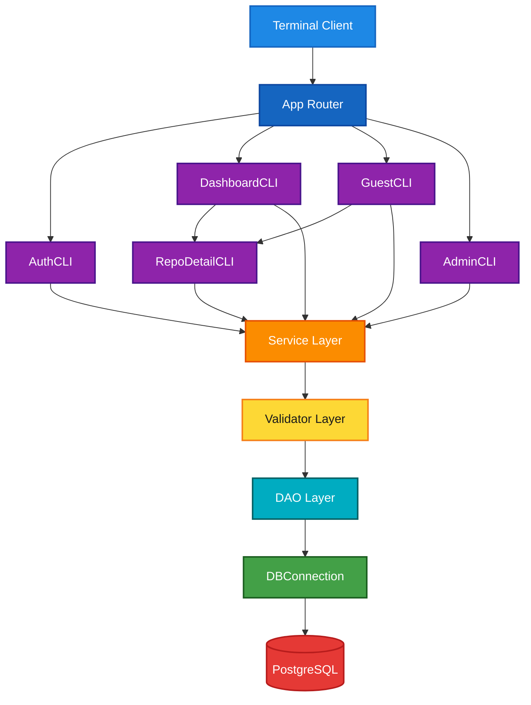
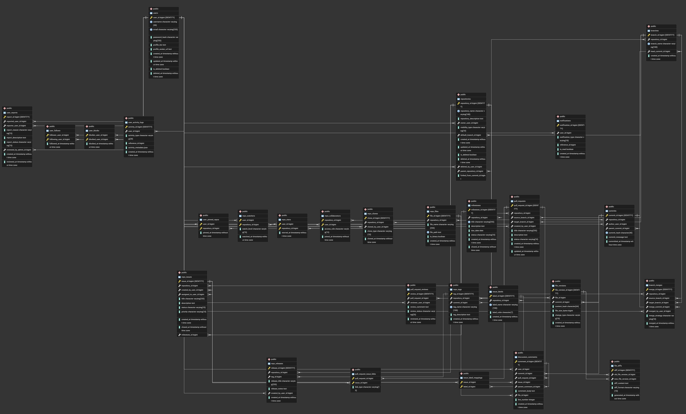

# RepoPulse

A GitHub-inspired collaborative version control platform built from scratch in Java with PostgreSQL — featuring
repositories, branches, commits, pull requests, issues, discussions, releases, and role-based access control through a
modular terminal application.


---

## Why RepoPulse?

RepoPulse was built to model how real-world platforms like GitHub persist collaborative development workflows in a
relational database. Instead of treating version control as file storage alone, it maps users, repositories, branches,
commits, reviews, and social interactions into a normalized PostgreSQL schema with a clean layered Java backend.

The focus is on **DBMS design**, **transaction-safe data modeling**, and **modular backend architecture** — not on
replicating every Git protocol detail.

---

## Overview

RepoPulse simulates a full developer platform through a terminal CLI backed by 27 relational tables. Core systems
concepts explored include:

- Normalized relational schema design (1NF → 3NF, selective BCNF)
- Layered application architecture (CLI → Service → DAO → DB)
- Role-based repository access control
- Self-referencing commit graphs and threaded discussions
- Junction tables for many-to-many relationships
- Soft deletes, activity logging, and notification modeling

Authenticated users get a personal dashboard; guests can browse public repositories; admins manage moderation workflows.

---

## Features

- 🔐 User authentication with signup, login, guest mode, and admin panel
- 👤 Profiles with follow, block, report, and pinned repositories
- 📦 Repository lifecycle — create, fork, star, watch, clone, soft-delete
- 🔒 Visibility control — `PUBLIC`, `PRIVATE`, `INTERNAL` with collaborator roles
- 🌿 Branch management with merge tracking (`MERGE`, `SQUASH`, `REBASE`)
- 📝 Commit history with SHA-style hashes and parent-child chains
- 🔀 Pull requests with reviews, status tracking, and issue linking
- 🐛 Issue tracking with labels, milestones, assignment, and priority
- 💬 Threaded discussions on commits, pull requests, and issues
- 🏷 Releases and tags anchored to commits
- 📄 File versioning with diffs and change-type tracking
- 🔔 Notifications and JSON-backed activity logs
- 🛡 Input validation and centralized error handling

---

## Application Flow

| Session         | Entry Point    | Capabilities                                      |
|-----------------|----------------|---------------------------------------------------|
| Unauthenticated | `AuthCLI`      | Login, signup, guest browse, admin login, exit    |
| Guest           | `GuestCLI`     | Explore public repos, search user profiles        |
| User            | `DashboardCLI` | Profile, repositories, user search, notifications |
| Admin           | `AdminCLI`     | Review reports, block/unblock users               |

Inside a repository, `RepoDetailCLI` exposes code, commits, branches, pull requests, issues, releases, discussions,
collaborators, stars, tags, and watchers — gated by `RepoAccessService`.

---

## Access Control

| Visibility | Read Access           | Write Access                                                |
|------------|-----------------------|-------------------------------------------------------------|
| `PUBLIC`   | Everyone              | Owner + collaborators with `WRITE` / `MAINTAINER` / `OWNER` |
| `INTERNAL` | Any logged-in user    | Owner + write-role collaborators                            |
| `PRIVATE`  | Owner + collaborators | Owner + write-role collaborators                            |

Collaborator roles: `OWNER`, `MAINTAINER`, `WRITE`, `READ`.

---

## Domain Operations

| Domain           | Operations                                                               |
|------------------|--------------------------------------------------------------------------|
| **Auth**         | Signup, login, admin login, guest access                                 |
| **User**         | Update profile, follow/unfollow, block, report, pin repos                |
| **Repository**   | Create, fork, update, delete, explore, manage collaborators              |
| **Branch**       | Create, list, merge (with strategy), set default branch                  |
| **Commit**       | Create with parent link, view history, generate commit hash              |
| **Pull Request** | Open, close, merge, add reviews, link issues (`CLOSES` / `REFERENCES`)   |
| **Issue**        | Create, assign, close, label, attach to milestones                       |
| **Discussion**   | Comment on commits/PRs/issues with nested replies                        |
| **Release**      | Create releases from tags with release notes                             |
| **File**         | Track files, store versions per commit, record diffs                     |
| **Notification** | View and mark notifications (`FOLLOW`, `PR`, `ISSUE`, `STAR`, `COMMENT`) |

---

## Architecture



**Flow:** Terminal → `App` router → CLI modules → Service → Validator → DAO → `DBConnection` → PostgreSQL

### Layer Responsibilities

| Layer     | Package        | Responsibility                               |
|-----------|----------------|----------------------------------------------|
| CLI       | `*/cli/`       | Menus, user input, navigation                |
| Service   | `*/service/`   | Business rules, orchestration, access checks |
| Validator | `*/validator/` | Input and enum validation                    |
| Model     | `*/model/`     | Entity POJOs mapped to table rows            |
| DAO       | `*/dao/`       | PreparedStatement SQL and CRUD               |
| Infra     | `infra/`       | Config, JDBC connection, session, exceptions |

### Module Map

| Module         | Tables Touched                                                                                    | Purpose                             |
|----------------|---------------------------------------------------------------------------------------------------|-------------------------------------|
| `auth`         | `users`                                                                                           | Login, signup, admin authentication |
| `user`         | `users`, `user_follows`, `user_blocks`, `user_reports`, `user_pinned_repos`, `user_activity_logs` | Profiles and social features        |
| `repository`   | `repositories`, `repo_collaborators`, `repo_stars`, `repo_watchers`, `repo_clones`, `repo_tags`   | Repo lifecycle and engagement       |
| `branch`       | `branches`, `branch_merges`                                                                       | Branching and merge history         |
| `commit`       | `commits`                                                                                         | Commit graph and hashing            |
| `pullrequest`  | `pull_requests`, `pull_request_reviews`, `pull_request_issue_links`                               | Code review workflow                |
| `issue`        | `repo_issues`, `issue_labels`, `issue_label_mappings`, `milestones`                               | Issue and milestone tracking        |
| `discussion`   | `discussion_comments`                                                                             | Threaded comments across entities   |
| `release`      | `repo_releases`                                                                                   | Version releases                    |
| `file`         | `repo_files`, `file_versions`, `file_diffs`                                                       | File history and diffs              |
| `notification` | `notifications`                                                                                   | User notification delivery          |

---

## Database Design

RepoPulse centers on a **27-table normalized PostgreSQL schema** defined in `database/DDL.sql`.



### Schema Highlights

| Category      | Tables                                                              | Notable Design Choices                                                    |
|---------------|---------------------------------------------------------------------|---------------------------------------------------------------------------|
| Core VC       | `repositories`, `branches`, `commits`, `branch_merges`              | Self-referencing commits; deferred FKs for default branch and fork origin |
| Collaboration | `repo_collaborators`, `pull_requests`, `pull_request_reviews`       | Role-based access; review status enums                                    |
| Issues        | `repo_issues`, `milestones`, `issue_labels`, `issue_label_mappings` | Many-to-many labels via junction table                                    |
| Social        | `repo_stars`, `repo_watchers`, `user_follows`, `repo_clones`        | Composite primary keys                                                    |
| Moderation    | `user_reports`, `user_blocks`                                       | Admin review workflow                                                     |
| Content       | `repo_files`, `file_versions`, `file_diffs`                         | Version-per-commit with diff storage                                      |
| Activity      | `notifications`, `user_activity_logs`                               | Typed events; JSON metadata column                                        |

### SQL Concepts Used

Primary keys, foreign keys, composite keys, `CHECK` constraints, `UNIQUE` constraints, identity columns, junction
tables, self-referencing relations, soft deletes, and JSON columns.

### Normalization

The schema satisfies **1NF, 2NF, and 3NF** across all relations. Most tables also satisfy **BCNF**; a few intentionally
remain at 3NF where further decomposition would add complexity without practical benefit (e.g., `repositories`,
`branches`, `discussion_comments`). Full proofs: [`database/normalization.md`](database/normalization.md).

---

## Project Structure

```
RepoPulse
│
├── database/
│   ├── DDL.sql                 # Full schema (27 tables)
│   ├── seed.sql                # Sample data
│   ├── ERD.png                 # Entity-relationship diagram
│   └── normalization.md        # Normalization proofs
│
├── src/main/java/com/repopulse/
│   ├── auth/                   # Authentication
│   ├── user/                   # Profiles, social, admin
│   ├── repository/             # Repos, collaborators, stars
│   ├── branch/                 # Branches and merges
│   ├── commit/                 # Commit graph
│   ├── pullrequest/            # PR workflow and reviews
│   ├── issue/                  # Issues, labels, milestones
│   ├── discussion/             # Threaded comments
│   ├── release/                # Releases
│   ├── file/                   # File versions and diffs
│   ├── notification/           # Notifications
│   ├── infra/                  # Config, JDBC, session, utils
│   ├── App.java                # Session router
│   └── Main.java               # Entry point
│
├── src/main/resources/
│   └── config.properties.example
│
├── src/test/java/              # DAO and service tests
├── pom.xml
├── LICENSE
└── README.md
```

Each domain module follows the same internal layout:

```
module/
├── cli/        # Terminal menus
├── service/    # Business logic
├── dao/        # SQL access
├── model/      # Entity classes
└── validator/  # Input rules
```

---

## Build

### Prerequisites

- Java 26+
- PostgreSQL 14+
- Maven 3.8+

### Setup

```bash
git clone https://github.com/<your-username>/RepoPulse.git
cd RepoPulse
```

Create the database:

```sql
CREATE
DATABASE repopulse_db;
```

Apply schema and seed data:

```bash
psql -U postgres -d repopulse_db -f database/DDL.sql
psql -U postgres -d repopulse_db -f database/seed.sql
```

Configure the application:

```bash
cp src/main/resources/config.properties.example src/main/resources/config.properties
```

Update `db.url`, `db.username`, and `db.password` in `config.properties`.

Build and run:

```bash
mvn clean install
mvn exec:java -Dexec.mainClass="com.repopulse.Main"
```

---

## Run

On launch, `App` routes the session based on authentication state:

```
Unauthenticated → AuthCLI (login / signup / guest / admin)
Logged-in user  → DashboardCLI
Admin session   → AdminCLI
```

From the dashboard, open **My Repositories** to enter `RepoDetailCLI` and access the full repository workflow.

---

## Technologies

- Java 26
- PostgreSQL
- JDBC (`DriverManager`, `PreparedStatement`)
- Maven
- Layered modular architecture
- Session-based in-memory auth state
- SHA-style commit hash generation

---

## Key Learnings

- Designing a multi-entity relational schema for a developer platform
- Applying normalization (1NF–3NF) with pragmatic BCNF trade-offs
- Building a layered backend with clear separation of concerns
- Modeling self-referencing data (commits, comments, repository forks)
- Enforcing access control at the service layer
- Mapping complex workflows — PR reviews, issue linking, merge strategies — to SQL
- Handling many-to-many relationships with junction tables

---

## Future Improvements

- REST API layer with JWT authentication
- Web-based frontend
- Password hashing and prepared-statement hardening
- Repository analytics dashboard
- Real-time notifications
- Expanded unit and integration test coverage
- Git-compatible object storage

---

## License

This project is licensed under the MIT License — see [`LICENSE`](LICENSE).

---

Built by **Raj Patel** to explore DBMS design, relational modeling, layered backend architecture, and collaborative
platform internals inspired by GitHub.
